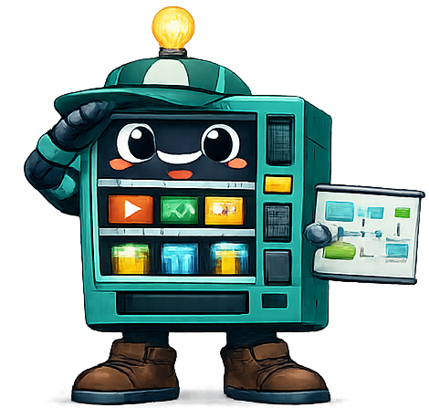
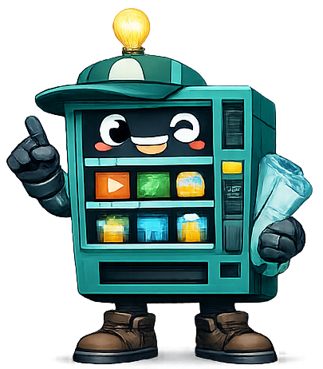
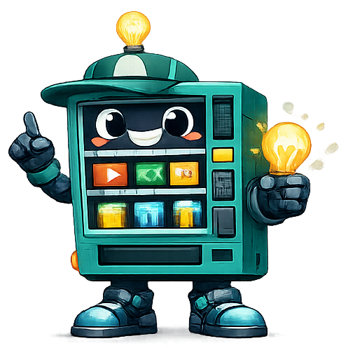
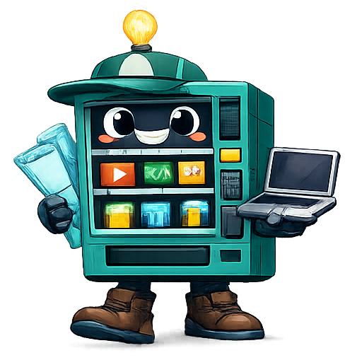

<div align="center">


# SkillDrop

### Una plataforma de aprendizaje basada en la maestría, con cursos prácticos evaluados por un mentor.

**🌐 [English](README.md) · Español**

[](https://react.dev/)
[](https://vitejs.dev/)
[](https://www.typescriptlang.org/)
[](https://nodejs.org/)
[](https://www.prisma.io/)
[](LICENSE)

<em>"No avances por completar lecciones. Avanza porque puedes demostrar dominio."</em>

</div>

---

## 🎯 ¿Qué es SkillDrop?

**SkillDrop** no es otra biblioteca de tutoriales. Es una **plataforma para cursos basados en la maestría**: un entorno de entrenamiento profesional guiado donde cada lección sigue el mismo ciclo que haría contigo un mentor senior:

> **Mini‑teoría → Reto realista → Entrega → Evaluación del mentor (rúbrica) → Reintento**

Y **no avanzas hasta demostrar que dominas la fase**. Sin saltarte pasos. Sin humo.

La plataforma es **independiente del curso por diseño** (arquitectura multi‑curso). Su primer curso estrella es un **bootcamp completo de Figma, UI/UX y Product Design** que te lleva de cero a *"diseñador de producto digital con mentalidad frontend"* — y con el tiempo se sumarán más cursos al catálogo.

<div align="center">
&nbsp;&nbsp;&nbsp;
&nbsp;&nbsp;&nbsp;

</div>

---

## ✨ Características

- 🗺️ **Roadmap visual** — 13 fases (0 → 12) con estados bloqueada / disponible / en progreso / en revisión / completada.
- 📚 **Lecciones estructuradas** — teoría breve, conceptos clave, las herramientas exactas de Figma y un brief real.
- 🎯 **Retos realistas** — briefs profesionales con restricciones, entregables, checklists y errores comunes.
- 🧑‍🏫 **Evaluación tipo mentor** — cada entrega se puntúa de 1 a 10 por criterio de rúbrica, con feedback y mejoras obligatorias.
- 🔒 **Bloqueo por dominio** — avanzas solo con media ≥ 8 y ningún criterio crítico por debajo de 7 (spec §8).
- 📈 **Árbol de habilidades y progreso** — skills desbloqueables, XP, niveles, rachas y puntos fuertes/débiles.
- 🔁 **Reintentos versionados** — cada reenvío se guarda para comparar tu antes/después.
- 🌗 **UI premium** — limpia, moderna, modo claro y oscuro. Inspirada en Linear, Notion, Stripe y Figma.

---

## 🤖 Conoce a la mascota

A SkillDrop te guía una simpática **máquina expendedora** que en vez de snacks dispensa habilidades. Reacciona según el momento de tu aprendizaje:

| | Pose | Aparece cuando… |
|---|---|---|
|  | Guiño | Inicias sesión |
|  | Idea | Lees la mini‑teoría |
|  | Lápiz y bocetos | Trabajas en un reto |
|  | Portátil y documentos | Envías tu trabajo |
|  | Brazos arriba | Aprueban tu entrega |
|  | Megáfono y medalla | Ganas medallas y rachas |

---

## 🧱 Stack tecnológico

| Capa | Tecnología |
|---|---|
| **Frontend** | React + Vite + TypeScript, Tailwind CSS, React Router, TanStack Query |
| **Backend** | Node + Express + TypeScript |
| **Base de datos** | Prisma ORM + SQLite (migrable a Postgres cambiando el datasource) |
| **Auth** | JWT + bcrypt, por roles (`STUDENT` · `MENTOR` · `ADMIN`) |
| **Compartido** | Esquemas Zod y tipos TypeScript compartidos entre web + api |
| **Monorepo** | npm workspaces |

---

## 🚀 Puesta en marcha

> Requiere **Node ≥ 20** y **npm**.

```bash
# 1. Instalar todos los workspaces
npm install

# 2. Preparar la base de datos (SQLite) y aplicar migraciones
npm run db:migrate

# 3. Cargar el bootcamp de Figma completo (13 fases) + usuarios demo
npm run db:seed

# 4. Arrancar API + Web a la vez
npm run dev
```

- **Web:** http://localhost:5173
- **API:** http://localhost:4000

### Cuentas demo (tras el seed)

| Rol | Email | Contraseña |
|---|---|---|
| 🎓 Alumno | `student@skilldrop.dev` | `skilldrop` |
| 🧑‍🏫 Mentor | `mentor@skilldrop.dev` | `skilldrop` |

---

## 🗂️ Estructura del proyecto

```
skilldrop/
├── apps/
│   ├── api/        # Express + Prisma + SQLite (API REST, auth, motor de progreso)
│   └── web/        # Vite + React + Tailwind (la interfaz de la plataforma)
├── packages/
│   └── shared/     # Esquemas Zod + tipos TypeScript compartidos
├── assets/         # Ilustraciones de la mascota
└── spec.md         # Especificación completa del producto
```

---

## 🧭 Primer curso — Bootcamp de Figma (13 fases)

> El primer curso de la plataforma. Con el tiempo se añadirán más cursos al catálogo.

`0` Mentalidad y entorno · `1` Control visual · `2` Figma esencial · `3` UI real · `4` UX práctico · `5` Responsive · `6` Componentes · `7` Variables y design systems · `8` Prototipado · `9` Producto avanzado · `10` Handoff y Dev Mode · `11` IA y workflows · `12` Portfolio y freelancing

---

## 🛣️ Roadmap

- [x] MVP: contenido completo del curso, evaluación por mentor, bloqueo por dominio
- [ ] Catálogo multi‑curso y matriculación
- [ ] Feedback inicial asistido por IA
- [ ] Integración con la API de Figma (importar previews)
- [ ] Comunidad y retos semanales
- [ ] Certificados y portfolio público

---

## 📄 Licencia

Publicado bajo la [Licencia MIT](LICENSE).

<div align="center">
<br/>

<br/>
<sub>Hecho con cariño. Aprende haciendo. Demuestra tu dominio.</sub>
</div>
